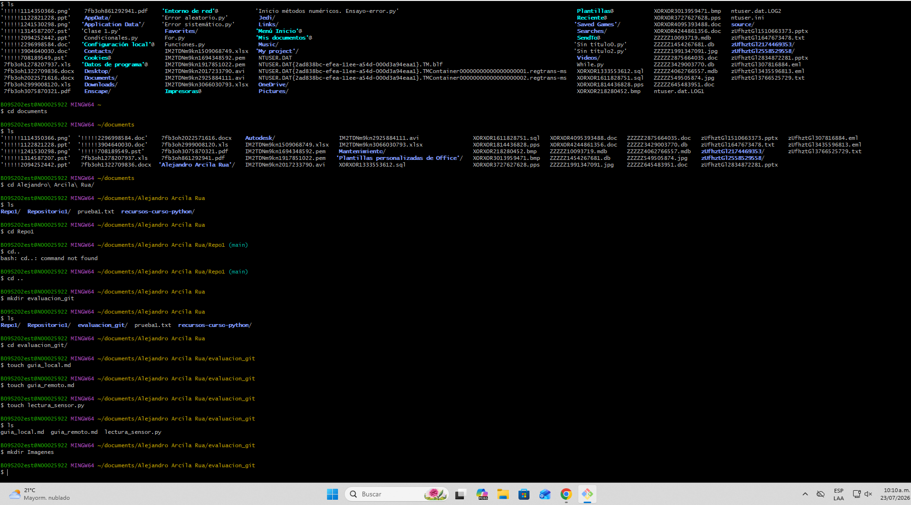

# PROCESO DE CREACIÓN REPOSITORIO  
A continuación se enlista una serie de paso a paso con los cuales podras navegar, crear carpetas y archivos e inicializar el repositorio resultante  

## Paso 1    
Lo primero que debes realizar es abrir el programa *"Git bash"* para ejecutar comandos.  
- Posteriormente emplearas el comando *"Pwd"* para ubicar en que carpeta te encuentras.
- Usas el comando *"Ls"* para listar los elementos de la carpeta y direccionarte hacia donde ubicaras tu repositorio.  
- Para navaegar entre carpetas debes de usar el comando "Cd **"INSERTE NOMBRE CARPETA DESTINO"**".
- Dentro de la carpeta elegida, crearemos nuestro repositorio mediante el comando **"mkdir "INSERTE NOMBRE REPOSITORIO"**
- Nos desplazamos hacia el interior de la carpeta y alli creamos nuestros tres archivos mediante el comando *"touch "INTERTE NOMBRE ARCHIVO".formato del archivo*  
- Cuando ya tengas todo tu repositorio listo, lo iniciaremos en git, mediante *"git init"*  

### Imagen evidencia:

